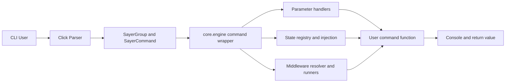

# Architecture

Sayer layers a decorator-driven command model on top of Click, with additional runtime features:

- parameter metadata and type conversion
- middleware hooks
- state/context injection
- enhanced help rendering

## System Architecture



## Component Interactions

```mermaid
flowchart TD
  Import[Python import time] --> Decorators[@command and @group decorators]
  Decorators --> Registries[COMMANDS and GROUPS registries]
  Registries --> Client[sayer.core.client bootstrap]
  Client --> Tree[Runtime Click command tree]
  Tree --> Execution[Invocation and dispatch]
  Execution --> Help[Rich help rendering]
```

## Design Implications

- Registration is import-driven: if modules are not imported, commands are not registered.
- Sayer extends Click behavior but keeps Click command/group compatibility.
- Runtime wrapper centralizes conversion, middleware, and async handling.

## Related

- [Command Lifecycle](./command-lifecycle.md)
- [Parameter System](./parameter-system.md)
- [Sayer and Sub-apps](../features/sayer-and-apps.md)
