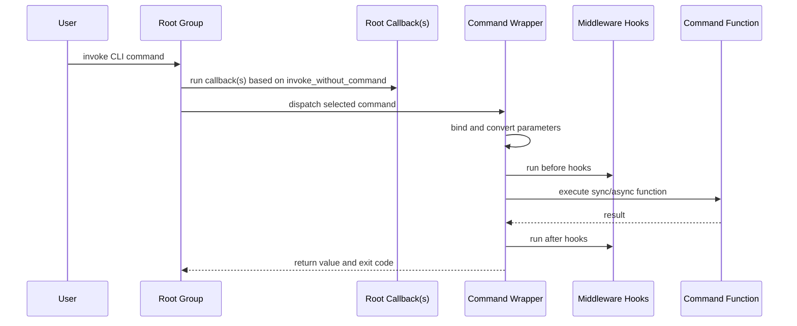

# Command Lifecycle

This page explains the request lifecycle from terminal input to command completion.

## Lifecycle Sequence

## Lifecycle Stages

1. Parse CLI arguments with Click.
2. Resolve command and command context.
3. Evaluate root callbacks.
4. Build bound arguments and injected dependencies.
5. Execute middleware before hooks.
6. Execute command (sync or async).
7. Execute middleware after hooks.
8. Store return value for test clients.

## Practical Guidance

- Use callbacks for CLI-level setup, not business logic.
- Keep middleware side-effect-aware and idempotent.
- Validate JSON and conversion errors close to parameter boundaries.

## Related

- [Architecture](./architecture.md)
- [Middleware Model](./middleware-model.md)
- [API Reference: Engine](../api-reference/core/engine.md)
