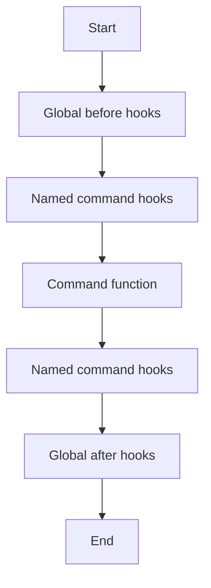

# Middleware Model

Middleware in Sayer adds before/after hooks around command execution.

## Execution Order

## Behavior Notes

- Hooks can be sync or async.
- Named middleware is resolved at command decoration time.
- Global middleware runs for every command.

## Design Guidance

- Use named middleware for domain concerns (audit, auth, telemetry).
- Keep hook signatures consistent (`(name, args)` and `(name, args, result)`).
- Avoid long-running blocking operations in hooks.

## Related

- [Feature Guide: Middleware](../features/middleware.md)
- [API Reference: Middleware](../api-reference/middleware.md)
- [Command Lifecycle](./command-lifecycle.md)
