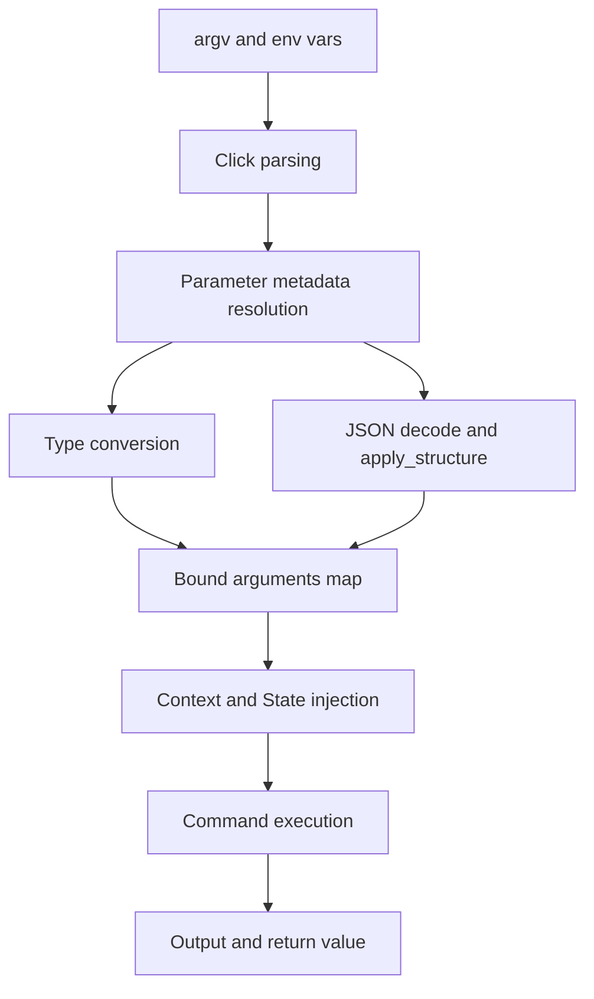

# Parameter System

Sayer translates annotated Python function signatures into Click parameters and typed runtime values.

## Mental Model

- Declaration layer: Python signature + metadata (`Option`, `Argument`, `Env`, `JsonParam`).
- Parsing layer: Click options/arguments.
- Conversion layer: type coercion and JSON molding.
- Invocation layer: bound arguments passed to your command function.

## Data Flow

## Parameter Selection

- `Option`: named values (`--region eu-west-1`).
- `Argument`: positional values (`deploy billing`).
- `Env`: environment-provided values (`API_TOKEN`).
- `JsonParam`: structured JSON payloads.

## Related

- [How-to: Use Parameters](../how-to/use-parameters.md)
- [Feature Guide: Parameters](../features/params.md)
- [API Reference: Params](../api-reference/params.md)
