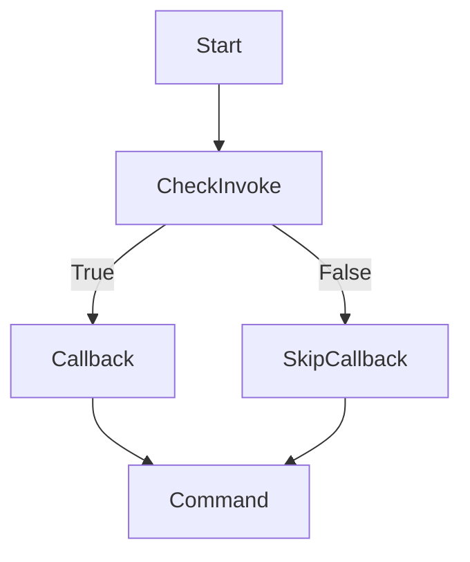

# Callbacks

This guide offers an exhaustive, thoroughly explained exploration of Sayer’s **@app.callback** system.
It includes detailed explanations of the purpose, behavior, and usage of callbacks, along with richly annotated examples and best practices.

## Overview

Sayer's `@app.callback` decorator is used to register a root-level function that is executed when the CLI is invoked. It can:

* **Run before commands** to perform initialization tasks.
* **Capture input parameters** (like options and arguments) directly from the CLI.
* **Control behavior** using `invoke_without_command`, deciding if the callback runs before commands or only when no commands are specified.

This feature is essential for:

* Setting up global context.
* Validating or preprocessing input.
* Managing configuration options shared across commands.

## Key Concepts

* **@app.callback**: Registers the callback function.
* **invoke\_without\_command**: Boolean flag controlling execution behavior. If `True`, the callback always runs; if `False`, it only runs when no subcommand is provided.
* **Parameter Injection**: Parameters are automatically injected based on CLI input, including:

  * `Option`: Optional or required flags.
  * `Argument`: Positional arguments.
  * `JsonParam`: JSON-formatted input.
  * Environment variable defaults.

## Fully Explained Examples

### Basic Callback: Why and How

This is the simplest callback, used to perform setup when the CLI runs.

```python
from sayer import Sayer

app = Sayer()


@app.callback()
def root():
    print("Root callback executed!")
```

**Why**: This callback executes every time the CLI runs (unless overridden by `invoke_without_command`). It's useful for initialization like setting up logging or loading configuration files.

### Callback with Options and Arguments

```python
from typing import Annotated
from sayer import Sayer, Option, Argument

app = Sayer()


@app.callback()
def root(name: Annotated[str, Option("--name", required=True)], path: Annotated[str, Argument()]):
    print(f"Name: {name}, Path: {path}")
```

**Why**: This example demonstrates how CLI options and arguments map directly to parameters in the callback. `--name` is a required flag, and `path` is a positional argument.
**How**: Sayer parses the CLI input and injects them as arguments to `root`.

### Optional Parameters with Defaults

```python
@app.callback()
def root(flag: Annotated[bool, Option("--flag", default=False)]):
    print(f"Flag: {flag}")
```

**Why**: Optional parameters allow customization without requiring explicit CLI input. Defaults are provided if the user omits them.
**How**: The flag is `False` by default, but `--flag` sets it to `True`.

### JSON Input with JsonParam

```python
from typing import Annotated
from sayer import Sayer, JsonParam

app = Sayer()

@app.callback()
def root(config: Annotated[dict, JsonParam()]):
    print(f"Config: {config}")
```

**Why**: JsonParam enables complex data input in JSON format, making it easier to handle structured data.
**How**: Pass `--config '{"key": "value"}'` to inject the parsed dictionary.

### Using Environment Variables as Fallbacks

```python
@app.callback()
def root(secret: Annotated[str, Option("--secret", envvar="MY_SECRET")]):
    print(f"Secret: {secret}")
```

**Why**: This approach supports secure and configurable defaults without exposing sensitive data in commands.
**How**: Sayer checks for the environment variable `MY_SECRET` if `--secret` isn't provided.

### Advanced Example: Multiple Parameters

```python
@app.callback()
def root(user: Annotated[str, Option("--user")], count: Annotated[int, Option("--count")], verbose: Annotated[bool, Option("--verbose")]):
    print(f"User: {user}, Count: {count}, Verbose: {verbose}")
```

**Why**: Real-world callbacks often need multiple parameters to control CLI behavior globally.
**How**: Each parameter maps to a corresponding option, with type conversion and defaults handled automatically.

### Controlling Callback Execution

```python
app = Sayer(invoke_without_command=False)  # Runs callback only when no subcommand
```

```python
app = Sayer(invoke_without_command=True)   # Runs callback before any subcommand
```

**Why**: This allows fine-grained control over when the callback executes.
**How**: Set `invoke_without_command` during app initialization.

### Asynchronous Callback

```python
import anyio

@app.callback()
async def root():
    await anyio.sleep(1)
    print("Async callback executed")
```

**Why**: Async callbacks can handle I/O operations like network requests.
**How**: Sayer detects the async function and awaits it during execution.

### Complete and Commented Example

```python
from sayer import Sayer, command
from typing import Annotated
from sayer.params import Option, JsonParam

app = Sayer(invoke_without_command=True)

# This callback sets up config and verbosity before commands
@app.callback()
def root(config: Annotated[dict, JsonParam()], verbose: Annotated[bool, Option("--verbose")], user: Annotated[str, Option("--user")]):
    print(f"Config: {config}, Verbose: {verbose}, User: {user}")

@command()
def greet():
    return "Hello!"
```

## Execution Flow Diagram



## Best Practices with Context and Explanation

* ✅ Clearly define parameter types to enable correct parsing.
* ✅ Use `invoke_without_command` thoughtfully to control execution order.
* ✅ Validate inputs in the callback to catch errors early.
* ✅ Use async callbacks for long-running or I/O-bound tasks.
* ✅ Leverage environment variables for secure configuration.
* ❌ Avoid stateful side-effects in callbacks to keep them testable.
* ❌ Don't assume callbacks always run; control with `invoke_without_command`.

## Conclusion

Sayer’s callback system provides powerful tools for pre-command logic, configuration management, and input handling. With this complete guide,
developers can confidently build sophisticated CLI applications with Sayer.
