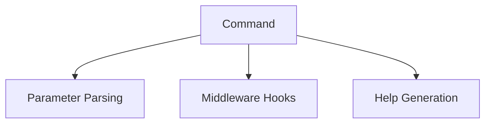

# Commands

This document provides an extensive, Django-style guide to Sayer’s command system. It offers detailed explanations, numerous examples, and actionable how-tos to help you fully leverage Sayer’s capabilities.

## What is a Command?

A command is a Python function decorated with `@command`. Sayer automatically parses parameters using `Annotated` types and manages help, execution flow, and middleware.

## Key Features of Sayer Commands

* Decorator-based registration (`@command`).
* Parameter parsing with `Annotated` types (Option, Argument, Env, JsonParam).
* Sync and async support.
* Middleware integration (before/after hooks).
* Rich help output with auto-generated parameter documentation.

## Step-by-Step Guide

### Defining Basic Commands

```python
from sayer import Sayer, command, Option
from typing import Annotated

app = Sayer(help="My CLI App")

@app.command()
def greet(name: Annotated[str, Option()], shout: Annotated[bool, Option()] = False):
    """Greet a user by name."""
    message = f"Hello, {name}!"
    if shout:
        message = message.upper()
    print(message)
```

Run:

```bash
python main.py greet --name Alice --shout
```

Output:

```
HELLO, ALICE!
```

### Complex Parameters with Annotations

```python
from sayer import Argument, Env, JsonParam
from typing import Annotated

@app.command()
def process(
    input_file: Annotated[str, Argument()],
    config: Annotated[dict, JsonParam()],
    token: Annotated[str, Env("API_TOKEN")],
    count: Annotated[int, Option()] = 1
):
    print(f"File: {input_file}, Config: {config}, Token: {token}, Count: {count}")
```

Run:

```bash
python main.py process input.txt --config '{"key": "value"}' --token secret --count 5
```

### Middleware Integration

```python
from sayer.middleware import add_before_global

async def before(ctx):
    print(f"Preparing to run {ctx.command.name}")
add_before_global(before)
```

### Subcommands and Groups

```python
from sayer import group, command

cli = group(help="Main CLI")

@cli.command()
def subcmd():
    print("Subcommand executed.")

cli()
```

### Async Commands

```python
from sayer import Sayer, command
import anyio

app = Sayer()

@app.command()
async def async_greet():
    await anyio.sleep(1)
    print("Async Hello!")

app()
```

### Dynamic Registration

```python
from sayer.utils.loader import load_commands_from
load_commands_from("myapp.commands")
```

### The decorator `@command`

## sayer `@command` decorator enhancements

Recent updates allow you to specify the command name both as a positional string argument *or* via the `name=` keyword, without interfering with signature
introspection and type inference.

### Usage Patterns

| Style                                   | Resulting CLI name        | Behavior                               |
| --------------------------------------- | ------------------------- | -------------------------------------- |
| `@command`                              | `func-name` → `func-name` | Defaults to function name, snake→kebab |
| `@command("custom-name")`               | `custom-name`             | Positional override                    |
| `@command(name="custom-name")`          | `custom-name`             | Keyword override                       |
| `@command(hidden=True, short_help="…")` | `func-name`, hidden       | Passes any Click attrs through         |

```python
from sayer.core.engine import command

# default: snake_case name → kebab-case
@command
def show_ctx_simple(ctx: click.Context):
    """Show context"""
    click.echo(ctx)

# positional name override
@command("list-things", help="List all things")
def list_things():
    ...

# keyword name + extra Click attrs
@command(name="push", hidden=True)
def do_push():
    """Push changes"""
    ...
```

Behind the scenes, `command()` now:

1. Peels off a first-positional `str` as the `name` override.
2. Falls back to `name=func.__name__.replace('_', '-')` if no override.
3. Pops `help=` from attrs or uses `func.__doc__`.
4. Forwards **all** other `**attrs` (e.g. `hidden`, `short_help`) into `@click.command(...)`.
5. Still inspects the **real** function to build parameters via `inspect.signature`.

---

## `Sayer.add_command` improvements

When mounting sub-apps or groups, the behavior now distinguishes three cases:

1. **`Sayer` instance**: Automatically unwraps and mounts its internal `SayerGroup`.
2. **`click.Group` (or `SayerGroup`)**: Mounted *as-is*, preserving nested subcommands and rich help.
3. **Leaf commands**: Any other `click.Command` is wrapped in `SayerCommand` to render rich help.

```python
from sayer import Sayer
import click

root = Sayer(name="root")
sub  = Sayer(name="sub")

@sub.command("run")
def run():
    """Run something"""
    pass

# mounts the sub-app under 'sub'
root.add_command(sub)
```

* `root sub --help` now shows `run` under `sub`.
* `root run` remains a rich `SayerCommand`.

This ensures that nested apps retain their full group behavior and rich help formatting.

## Comprehensive Best Practices

* ✅ Use clear docstrings and parameter annotations for help output.
* ✅ Test commands with different parameters and edge cases.
* ✅ Keep commands focused; delegate complex logic to functions.
* ✅ Use groups for modular CLI structures.
* ✅ Use `JsonParam` for structured inputs.
* ❌ Don’t mix `Option` and `Argument` on the same parameter.
* ❌ Avoid hardcoding sensitive data; use `Env` for secrets.

## Advanced Techniques

* Leverage dynamic module loading for large apps.
* Use async commands for network or I/O tasks.
* Customize middleware for logging, validation, or context prep.
* Implement complex parsers with `JsonParam`.

## Visual Diagram



## API Reference

* [Engine](../api-reference/core/engine.md)
* [Groups](../api-reference/core/groups.md)
* [Middleware](../api-reference/middleware.md)
* [Params](../api-reference/params.md)
