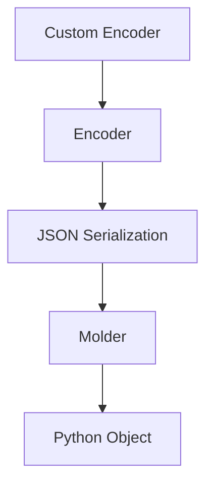

# Encoders

This document provides an in-depth guide to Sayer's encoders system.

## Overview

Sayer’s encoders handle how data is serialized and deserialized within CLI commands, particularly for JSON and complex types.

## Key Features of Sayer Encoders

* **Automatic serialization and deserialization** using built-in encoders.
* **Support for complex data types** including dataclasses, namedtuples, pydantic models, enums, paths, dates, and more.
* **Custom encoder and molder registration** for user-defined types.

## Understanding Encoders and Molders

An encoder converts a Python object into a JSON-compatible representation. A molder (deserializer) converts JSON-compatible data back into Python objects.

## Using Built-in Encoders

```python
from sayer.encoders import apply_structure, json_encode_default
from typing import NamedTuple

class User(NamedTuple):
    name: str
    age: int

user = User("Alice", 30)
json_data = json_encode_default(user)
print(json_data)  # {'name': 'Alice', 'age': 30}

restored_user = apply_structure(json_data, User)
print(restored_user)  # User(name='Alice', age=30)
```

## Registering Custom Encoders

```python
from sayer.encoders import register_encoder

class MyType:
    def to_dict(self):
        return {"value": 42}
    @staticmethod
    def from_dict(data):
        return MyType()

register_encoder(MyType)
```

## Using Encoders in Commands

```python
from sayer import Sayer, command, JsonParam
from typing import Annotated

app = Sayer()

@app.command()
def handle(data: Annotated[dict, JsonParam()]):
    print(data)
```

Run:

```bash
python main.py handle --data '{"key": "value"}'
```

## Advanced Use Cases

* Combine encoders with middleware to pre-process data.
* Use encoders for validating complex nested structures.
* Extend encoder support for custom types used in your app.

## Best Practices

* ✅ Use built-in encoders for common types.
* ✅ Register custom encoders early in app setup.
* ✅ Validate complex data during deserialization.
* ❌ Avoid unnecessary overwrites of default encoders.
* ❌ Ensure custom encoders are well-tested.

## Visual Diagram



## API Reference

* [Params](../api-reference/params.md)
* [Encoders](../api-reference/encoders.md)
