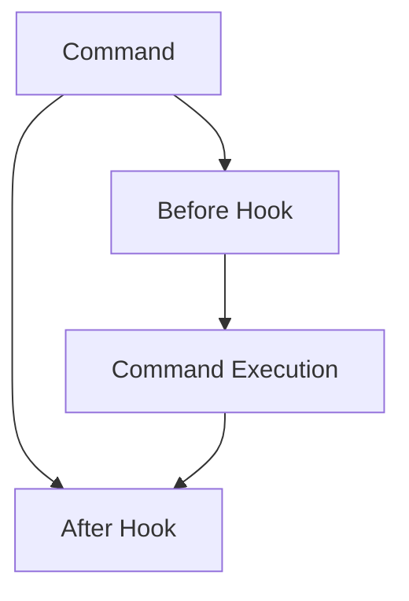

# Middleware

This document provides an in-depth guide to Sayer’s middleware system, complete with explanations, examples, and how-to usage.

## Overview

Middleware in Sayer allows you to insert logic before and after command execution. This can be used for:

* Logging and monitoring.
* Input validation.
* Context management.
* Security and authentication.

## Key Concepts

* **Global Middleware**: Applies to all commands.
* **Named Middleware Sets**: Reusable sets for specific commands.
* **`before` Hooks**: Run before command execution.
* **`after` Hooks**: Run after command execution.
* Supports both sync and async functions.

## Registering Global Middleware

```python
from sayer.middleware import add_before_global, add_after_global

async def before_hook(ctx):
    print(f"Before command: {ctx.command.name}")

async def after_hook(ctx):
    print(f"After command: {ctx.command.name}")

add_before_global(before_hook)
add_after_global(after_hook)
```

## Creating and Registering Named Middleware

```python
from sayer.middleware import register

async def before_cmd(ctx):
    print(f"Starting: {ctx.command.name}")

async def after_cmd(ctx):
    print(f"Finished: {ctx.command.name}")

register("logger", before=[before_cmd], after=[after_cmd])
```

Use it in a command:

```python
from sayer.middleware import resolve
before_hooks, after_hooks = resolve("logger")
```

## Combining with Commands

```python
@app.command(middleware=["logger"])
def greet():
    print("Hello!")
```

## Advanced Techniques

* Combine middleware with encoders for pre-processing.
* Use middleware for access control by checking context.
* Chain multiple named middlewares.
* Implement retry logic or performance logging.

## Best Practices

* ✅ Use async middleware for I/O-bound tasks.
* ✅ Keep middleware fast to avoid delaying CLI response.
* ✅ Test middleware hooks independently.
* ❌ Avoid long-running tasks inside middleware.
* ❌ Don’t rely on global state within middleware.

## Visual Diagram



## API Reference

* [Engine](../api-reference/core/engine.md)
* [Commands](./commands.md)
* [Encoders](./encoders.md)
