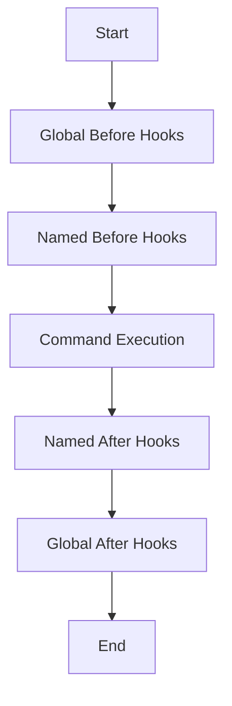

# Middleware

This document provides a comprehensive, in-depth guide to Sayer's middleware system, enriched with examples, explanations, and best practices inspired by real-world use cases and test scenarios.

## Overview

Sayer supports middleware hooks that can run **before** and **after** command execution, allowing developers to inject logic at key points of the CLI lifecycle.

## Key Concepts

* **Middleware Registry**: Holds named sets of middleware functions.
* **Global Middleware**: Hooks run for every command.
* **Named Middleware**: Defined sets attached to specific commands/groups.
* **Execution Flow**: Middleware can be synchronous or asynchronous.

## Registering Middleware

### Define Named Middleware Sets

```python
from sayer.middleware import register

def log_start(name, args):
    print(f"[Start] Command: {name}, Args: {args}")

def log_end(name, args, result):
    print(f"[End] Command: {name}, Result: {result}")

register("logger", before=[log_start], after=[log_end])
```

### Attach Middleware to Commands and Groups

```python
from sayer import command, group

@command(middleware=["logger"])
def greet(name):
    return f"Hello, {name}!"

admin = group(name="admin", middleware=["logger"])

@admin.command()
def shutdown():
    return "System shutting down."
```

### Global Middleware Hooks

```python
from sayer.middleware import add_before_global, add_after_global

add_before_global(lambda name, args: print(f"[Global Before] {name}"))
add_after_global(lambda name, args, result: print(f"[Global After] {name}"))
```

### Combining Named Middleware Sets

```python
register("audit", before=[lambda n, a: print(f"[Audit] {n}")])

@command(middleware=["logger", "audit"])
def report():
    return "Report generated."
```

### Asynchronous Middleware Example

```python
import anyio

async def async_before(name, args):
    await anyio.sleep(1)
    print(f"[Async Before] {name}")

async def async_after(name, args, result):
    await anyio.sleep(1)
    print(f"[Async After] {name}, Result: {result}")

register("async_logger", before=[async_before], after=[async_after])
```

## Execution Flow Diagram



## Best Practices

* ✅ Use descriptive names for middleware sets.
* ✅ Keep middleware logic isolated and testable.
* ✅ Leverage async middleware for I/O operations.
* ✅ Log meaningful information at both stages.
* ❌ Avoid blocking operations.
* ❌ Don't depend on command internals in global middleware.

## Advanced Tips and Use Cases

* **Error-Handling**: Wrap middleware functions in try-except blocks to handle errors without disrupting command execution.
* **Conditional Middleware**: Dynamically add middleware based on runtime config.
* **Testing Middleware**: Use mock hooks in tests to assert middlew
