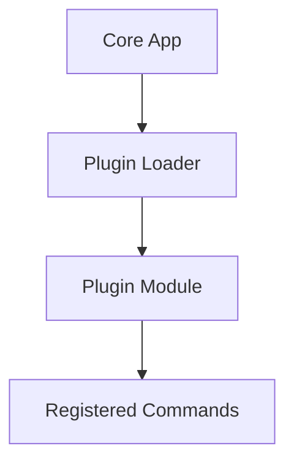

# Plugins Feature Guide

This document provides a detailed, Django-style guide to Sayer’s plugin system, with explanations, examples, and best practices.

## Overview

Sayer supports dynamic plugin loading via Python entry points, allowing modular CLI extension without changing the core app.

## Key Concepts

* **Entry Points**: Defined in `pyproject.toml` or `setup.cfg` to specify plugin modules.
* **register\_func()**: The function in the plugin module that registers commands.
* **Dynamic Loading**: `load_plugins()` scans and loads plugins at runtime.

## Writing a Plugin

1. **Define the Plugin Entry Point**

```toml
[project.entry-points."sayer.commands"]
myplugin = mypackage.module:register_func
```

2. **Implement register\_func()**

```python
def register_func():
    from sayer import command
    @command()
    def mycmd():
        print("Hello from my plugin!")
```

3. **Install the Plugin Package**

```bash
pip install -e .
```

4. **Run the CLI**

```bash
python main.py mycmd
```

Output:

```
Hello from my plugin!
```

## Advanced Tips

* Load plugins conditionally based on context.
* Handle import errors gracefully inside `register_func`.
* Use plugins to modularize large CLI applications.

## Best Practices

✅ Use entry points for clean plugin discovery.
✅ Ensure `register_func` is lightweight and free of side effects.
✅ Test plugins in isolation before integration.
❌ Avoid hard dependencies between core app and plugins.
❌ Don’t assume the presence of optional plugins.

## Visual Diagram



## API Reference

* [Plugins](../api-reference/core/pluggins.md)
* [Engine](../api-reference/core/engine.md)
* [Commands](./commands.md)
