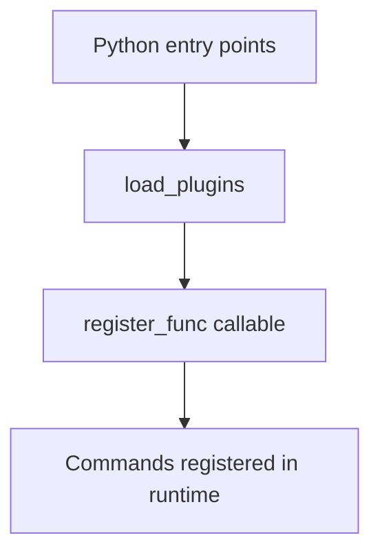

# Plugins Feature Guide

This guide explains how to extend Sayer using plugin entry points.

## Overview

Sayer loads plugins from Python entry points in the `sayer.commands` group. Each plugin provides a registration callable that adds commands to the runtime.

## Plugin Flow



## Create a Plugin

1. Define entry point:

```toml
[project.entry-points."sayer.commands"]
myplugin = mypackage.module:register_func
```

2. Implement registration callable:

```python
from sayer import command


def register_func():
    @command()
    def mycmd():
        print("Hello from plugin")
```

3. Install and run your CLI.

## Best Practices

- Keep registration lightweight.
- Avoid side effects in import paths.
- Treat plugin load errors as recoverable.

## Related

- [How-to: Build a Plugin](../how-to/build-plugin.md)
- [API Reference: Core Plugins](../api-reference/core/plugins.md)
- [Concepts: Architecture](../concepts/architecture.md)
