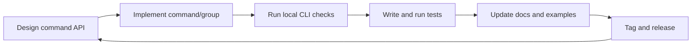

# Developer Workflow

This workflow covers the typical development loop for Sayer projects.

## Recommended Loop

1. Scaffold or update commands.
2. Run command-level smoke checks.
3. Add tests with `SayerTestClient`.
4. Validate docs/help output.
5. Release with clear changelog notes.

## Workflow Diagram

## Command Checklist

- help text present
- parameter types explicit
- examples included in docs
- tests include success and failure paths

## Related

- [How-to: Add a Command](../how-to/add-a-command.md)
- [How-to: Test CLI Behavior](../how-to/test-cli.md)
- [Contributing](../contributing.md)
